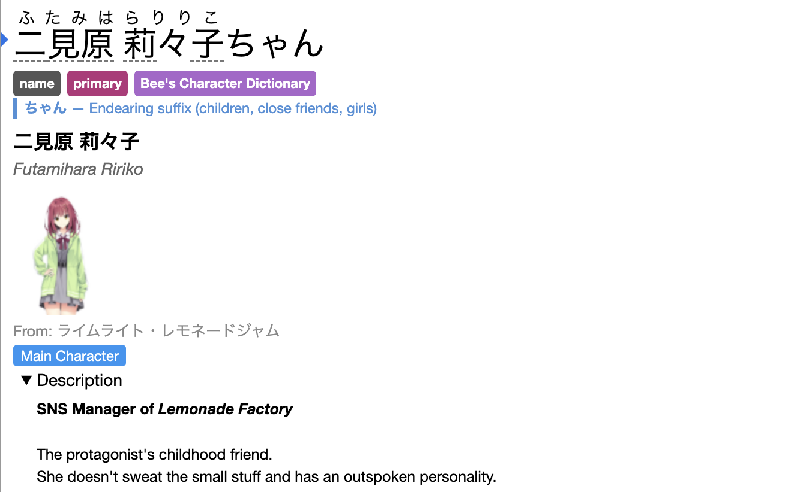

<p align="center">
  
  <br><br>
  <a href="https://characterdictionary.tokyo">https://characterdictionary.tokyo</a>
</p>

# Yomitan Character Dictionary Builder

A web application that generates **Yomitan-compatible character dictionaries** from VNDB (Visual Novel Database) and AniList (Anime/Manga). When installed in Yomitan (a browser dictionary extension for Japanese), looking up a character's Japanese name shows a rich popup card with their portrait, role, stats, and description.

## Features

* Put in your VNDB and Anilist IDs once, it will auto-update forever.
* No really, you will never have to reimport this dict or remake it.
* Fetches characters from any visual novel
* Also from Anilist which supports anime, manga and light novels
* Choose to show spoilers or none at all
* Dictionary has photos, descriptions, and tags
* Extensive honorific support, dictionary will tell you exactly how that person is being addressed
* Generates name variants (kanji, given name, hiragana, katakana etc)

## Quick Start

If you are capable to, please deploy this yourself to save me bandwidth.

You can do this with a single command:

```bash
podman run -d -p 3000:3000 -e HOST=0.0.0.0 ghcr.io/bee-san/japanese_character_name_dictionary:latest
```

The auto-updating requires the URL to be the same and to always be online. If it's not online, the dict won't update. But Yomitan etc will just retry it so it's not a big deal.

If you are an application developer (Manabi, JL, Lunatranslator, Manatan etc) point an AI agent at [`docs/agents_read_me.md`](docs/agents_read_me.md) and tell it to implement this. The AI agent will then copy and paste the code from this repo and integrate it with your app.

**All this below is AI slop btw**

### Building it

Install Rust

- [Rust](https://rustup.rs/) (1.70+)

### Build & Run

```bash
cargo build --release
cargo run --release
```

Visit **http://localhost:3000** in your browser.

### Podman / Docker

The easiest way to run the application — no Rust toolchain required. A prebuilt image is published to GHCR on every push to `main`. We recommend [Podman](https://podman.io/) (rootless, daemonless, and supports auto-updates), but Docker works too.

**Using Podman Compose (recommended):**

```yaml
# docker-compose.yml
services:
  yomitan-dict-builder:
    image: ghcr.io/bee-san/japanese_character_name_dictionary:latest
    ports:
      - "3000:3000"
    environment:
      - PORT=3000
      - HOST=0.0.0.0
      - BASE_URL=http://localhost:3000
    volumes:
      - cache-data:/var/cache/yomitan
    labels:
      - "io.containers.autoupdate=registry"
    restart: unless-stopped

volumes:
  cache-data:
```

```bash
podman compose up -d
```

The app will be available at **http://localhost:3000**.

To manually update to the latest image:

```bash
podman compose pull
podman compose up -d
```

**Using Podman directly:**

```bash
podman run -d \
  --name yomitan-dict-builder \
  -p 3000:3000 \
  -e HOST=0.0.0.0 \
  -e BASE_URL=http://localhost:3000 \
  -v yomitan-cache:/var/cache/yomitan \
  --label io.containers.autoupdate=registry \
  ghcr.io/bee-san/japanese_character_name_dictionary:latest
```

**Auto-updates with Podman:**

Podman can automatically check GHCR for new images and restart the container:

```bash
# Enable the auto-update timer (checks daily)
systemctl --user enable --now podman-auto-update.timer

# Or check manually
podman auto-update --dry-run  # preview what would update
podman auto-update             # pull and restart
```

### Environment Variables

| Variable | Default | Description |
|---|---|---|
| `PORT` | `3000` | Port the server listens on inside the container (or bare metal) |
| `BASE_URL` | `http://127.0.0.1:{PORT}` | Public URL used in Yomitan auto-update index URLs. Set this to your domain. |
| `CACHE_DIR` | `./cache` (debug) / `/var/cache/yomitan` (release) | Directory for the disk-backed image cache |
| `RUST_LOG` | `info` | Log level filter (e.g. `debug`, `warn`, `info,yomitan_dict_builder=debug`) |

### Deploying on a Server with a Custom Domain

The auto-update feature works by encoding all dictionary settings into the URL. Yomitan stores the index URL and re-fetches it on update checks, so the server needs to be reachable at a stable URL.

**1. Set `BASE_URL` to your public domain:**

```bash
# Bare metal
BASE_URL=https://dict.example.com PORT=8080 cargo run --release

# Docker
docker run -d \
  -p 80:3000 \
  -e HOST=0.0.0.0 \
  -e BASE_URL=https://dict.example.com \
  -v yomitan-cache:/var/cache/yomitan \
  ghcr.io/bee-san/japanese_character_name_dictionary:latest
```

**2. With Podman Compose and a reverse proxy (Caddy, nginx, etc.):**

```yaml
# docker-compose.yml
services:
  yomitan-dict-builder:
    image: ghcr.io/bee-san/japanese_character_name_dictionary:latest
    network_mode: host
    environment:
      - PORT=3000
      - HOST=127.0.0.1
      - BASE_URL=https://dict.example.com
    volumes:
      - cache-data:/var/cache/yomitan
    labels:
      - "io.containers.autoupdate=registry"
    restart: unless-stopped

volumes:
  cache-data:
```

```bash
podman compose up -d
```

Then point your reverse proxy at `localhost:3000`. Example Caddy config:

```
dict.example.com {
    reverse_proxy localhost:3000
}
```

**3. How it works:**

- User imports a dictionary via the index URL, e.g. `https://dict.example.com/api/yomitan-index?vndb_user=foo&spoiler_level=1`
- Yomitan stores that full URL internally
- On update check, Yomitan re-fetches the index → the server returns a `downloadUrl` with the same query params pointing at `BASE_URL`
- Yomitan downloads the fresh ZIP → dictionary is regenerated with the original settings
- The URL IS the configuration. No accounts, no server-side state.

The image cache (`/var/cache/yomitan`) persists downloaded character portraits across restarts. Mount it as a Docker volume to avoid re-downloading images on container recreation.

### Usage

1. Select source (VNDB or AniList)
2. Enter the media ID (e.g., `v17` for VNDB, `9253` for AniList)
3. Select media type (Anime/Manga) if using AniList
4. Choose spoiler level
5. Click "Generate Dictionary"
6. Import the downloaded ZIP file into Yomitan

## Architecture

```
yomitan-dict-builder/
├── Cargo.toml
├── src/
│   ├── main.rs              # Axum server, routes
│   ├── models.rs            # Shared data structures
│   ├── vndb_client.rs       # VNDB API client
│   ├── anilist_client.rs    # AniList GraphQL client
│   ├── name_parser.rs       # Japanese name → hiragana readings + honorifics
│   ├── content_builder.rs   # Yomitan structured content JSON builder
│   ├── image_handler.rs     # Base64 decode, format detection
│   └── dict_builder.rs      # ZIP assembly orchestrator
├── static/
│   └── index.html           # Frontend (single file with embedded CSS+JS)
└── README.md
```

## API Endpoints

| Endpoint | Method | Description |
|---|---|---|
| `/` | GET | Serves the web frontend |
| `/api/yomitan-dict` | GET | Generates and returns dictionary ZIP |
| `/api/yomitan-index` | GET | Returns lightweight index metadata (for update checks) |

### Query Parameters

| Parameter | Required | Values | Description |
|---|---|---|---|
| `source` | Yes | `vndb`, `anilist` | Data source |
| `id` | Yes | String | Media ID (e.g., `v17`, `9253`) |
| `spoiler_level` | No | `0`, `1`, `2` | Spoiler filtering (default: `0`) |
| `media_type` | No | `ANIME`, `MANGA` | AniList media type (default: `ANIME`) |

## Spoiler Levels

- **Level 0 (No Spoilers)**: Name, image, game title, role badge only
- **Level 1 (Minor Spoilers)**: + Description (spoiler tags stripped) + stats + traits (spoiler ≤ 1)
- **Level 2 (Full Spoilers)**: + Full unmodified description + all traits

## License

MIT

Please credit and sponsor me <3
